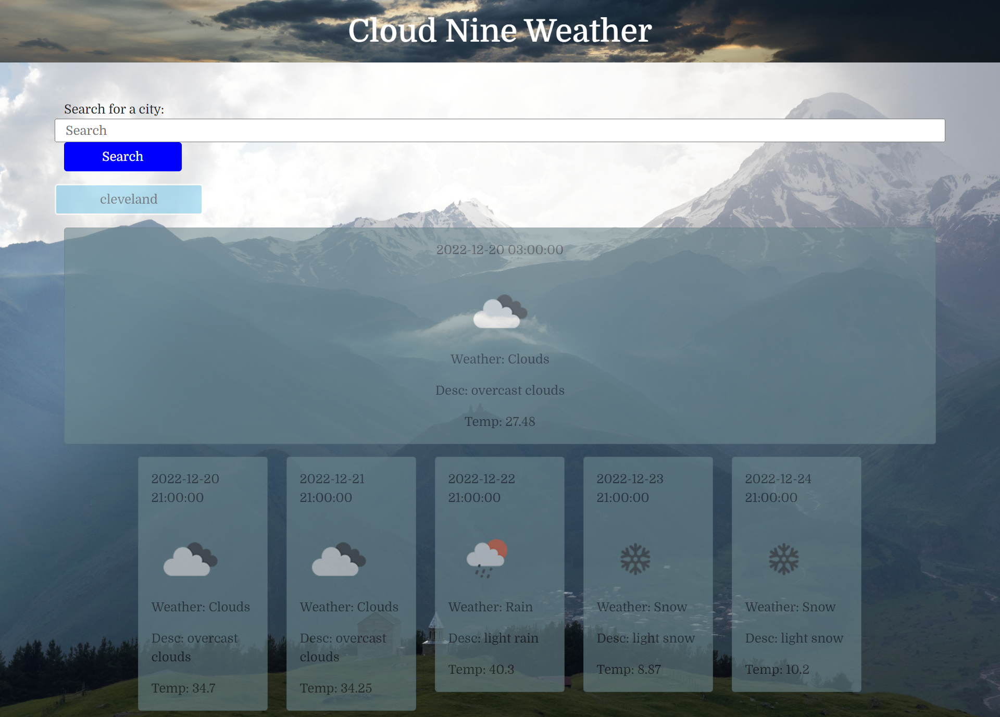

# Cloud Nine Weather App

## Description

I built this project in order to give people an easier way to check the weather. I wanted to make a slick and interactive weather app, to provide people with a look at the weather ahead. Instead of constantly searching for reliable weather sites, or checking outside, just look at my website and plan your day accordingly. I learned how to fetch and display API information through this project.

## Installation

N/A

## Usage

To use the app, simply type in the name of a city to look up the weather. Today's weather and the week's weather will be displayed. If you fail to enter in the name of the city, or the API is down, you will receive an error.

https://lucasbielinski.github.io/bielinskiweather/

## Credits

All images taken from wikimedia commons

banner image by Leviathan1983
https://commons.wikimedia.org/wiki/User:Leviathan1983
backround image by Vyacheslav Argenberg
https://commons.wikimedia.org/wiki/User:Argenberg

## How to Contribute

For questions and contributions, you can reach me here:
[Email](mailto:bielinskilucas@gmail.com)
or
[Github](https://github.com/LucasBielinski)

